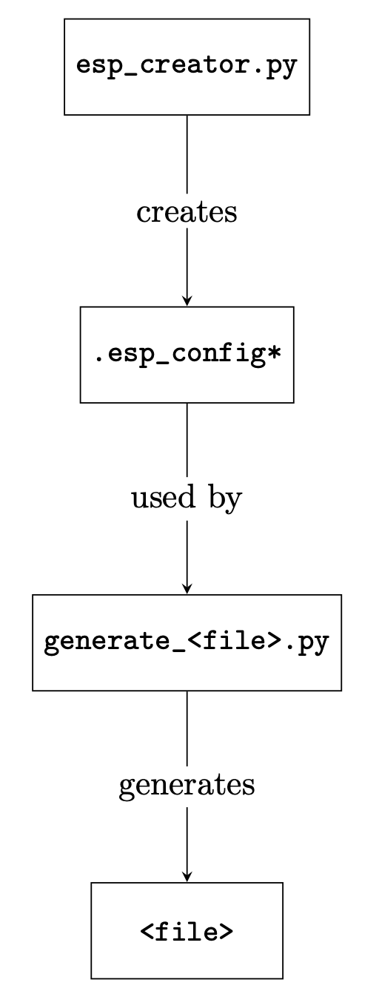

# Socgen

This directory contains tools for configuring and generating an ESP SoC. The directory also contains the various file generators for `.esp_config` and other files derived from it. 

This directory is organized as follows:
* `esp_creator.py` configures and generates an ESP SoC in GUI mode
  * To run the GUI, enter the directory of an FGPA board (ex: `esp/socs/xilinx-vc707-xc7vx485t/`) and run `$ make esp-xconfig`
* `esp_creator_batch.py` configures and generates an ESP SoC in batch mode
* `soc.py` contains the definition and structure of an ESP SoC, which is then configured by `esp_creator*.py` files
* `NoCConfiguration.py` contains most of the logic and setup functions relating to the NoC Configuration/tile floorplanning, which are used by `esp_creator*.py` and `soc.py` files 
* `constants.py` contains definitions of constants used in `generate_S64esp.py`, `generate_socmap_h.py`, and `generate_socmap_vhd.py` files
* `generate_cache_config_svh.py` which generates the `cache_cfg.svh` file. The `cache_cfg.svh` file defines `BIG`/`LITTLE_ENDIAN`, `ADDR`/`BYTE`/`WORD_BITS`, `L2`/`LLC_SETS`/`WAYS`.
* `generate_esp_global_vhd.py` which generates the `esp_global.vhd` file. The `esp_global.vhd` file defines global constants for architecture parameters.
* `generate_mmi64.py` which generates the `mmi64_regs.h` file. The `mmi64_regs.h` file defines various `*_NUM` and `_offset` constants and constants for individual tile.
* `generate_power.py` which generates the `power.h` file. The `power.h` file defines `energy_weight` and `period` vectors.
* `generate_riscv_dts.py` which generates the `riscv.dts` file.
* `generate_S64esp.py` which generates `S64esp` file.
* `generate_socmap_h.py` which generates `socmap.h` file. The `socmap.h` file defines `EDCL_IP`, `BASE_FREQ`, `*_BASE_ADDR`, `RODATA_START_ADDR`, `TARGET_BYTE_ORDER` constants.
* `generate_socmap_vhd.py` which generates `socmap.vhd` file.

The overall flow is described below:

First, `esp_creator.py` creates the `.esp_config*` files, which are then used by the file generators. For each file generator in the named `generate_<file>.py`, the file `<file>` is created.

# Old README.md

## Files

### `constants.py`
- Contains constants used by all file generators

### `generate_cache_config_svh.py`
- Generates `cache_cfg.svh` file
- Defines `BIG`/`LITTLE_ENDIAN`, `ADDR`/`BYTE`/`WORD_BITS`, `L2`/`LLC_SETS`/`WAYS`
- Run using: `python3 cache_cfg_svh.py NOC_WIDTH) $(TECHLIB) $(LINUX_MAC) $(LEON3_STACK)`

### `generate_esp_global_vhd.py`
- Generates `esp_global_vhd` file
- Defines global constants for architecture parameters
- Run using: `python3 generate_esp_global_vhd.py $(NOC_WIDTH) $(TECHLIB) $(LINUX_MAC) $(LEON3_STACK)`

### `generate_mmi64.py`
- Generates `mmi64_regs.h` file
- Defines various `*_NUM` and `_offset` constants and constants for individual tile
- Run using: `python3 generate_mmi64.py $(NOC_WIDTH) $(TECHLIB) $(LINUX_MAC) $(LEON3_STACK)`

### `generate_power.py`
- Generates `power.h` file
- Defines `energy_weight` and `period` vectors
- Run using: `python3 generate_power.py $(NOC_WIDTH) $(TECHLIB) $(LINUX_MAC) $(LEON3_STACK)`

### `generate_riscv_dts.py`
- Generates `riscv.dts` file
- Run using: `python3 generate_riscv_dts.py $(NOC_WIDTH) $(TECHLIB) $(LINUX_MAC) $(LEON3_STACK)`

### `generate_S64esp.py`
- Generates `S64esp` file
- Run using: `python3 generate_S64esp.py $(NOC_WIDTH) $(TECHLIB) $(LINUX_MAC) $(LEON3_STACK)`

### `generate_socmap_h.py`
- Generates `socmap.h` file
- Defines `EDCL_IP`, `BASE_FREQ`, `*_BASE_ADDR`, `RODATA_START_ADDR`, `TARGET_BYTE_ORDER` constants
- Run using: `python3 generate_socmap_h.py $(NOC_WIDTH) $(TECHLIB) $(LINUX_MAC) $(LEON3_STACK)`

### `generate_socmap_vhd.py`
- Generates `socmap.vhd` file
- Run using: `python3 generate_socmap_vhd.py $(NOC_WIDTH) $(TECHLIB) $(LINUX_MAC) $(LEON3_STACK)`

## To do
- Add descriptions for `generate_riscv_dts.py`, `generate_S64esp.py`, and `generate_socmap_h.py` in `README.md` 
